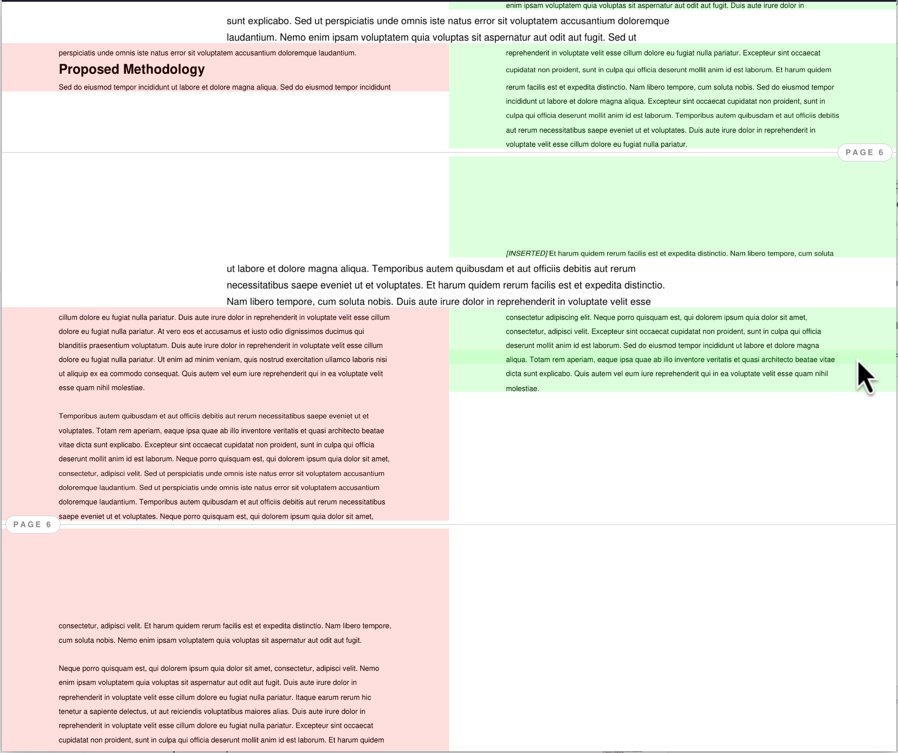

# PDF Visual Diff



A high-performance CLI tool designed for precise visual comparison of PDF documents. It automates the process of identifying deletions, insertions, and modifications by analyzing the visual layout rather than just the underlying text stream.

## Key Features

- **Block-Based Visual Analysis**: Intelligently segments the document into logical content blocks to identify deletions, insertions, and modifications within their visual context.
- **Dynamic Layout Options**: Seamlessly toggle between a side-by-side **Split View** and a stacked **Unified View**.
- **Accurate Document Rhythm**: Preserves original vertical spacing for a natural reading experience.
- **Modern UI Components**: Features polished diff tints and side-aware page breaks.
- **Zero-Install Execution**: Run the tool instantly from a remote repository via `uvx`.

## Quick Run (One-off)

You can run the tool directly from GitHub without cloning or installing:

```bash
uvx --from git+https://github.com/aziis98/pdf-diff-viewer.git pdf-diff-viewer --open <old.pdf> <new.pdf>
```

## Installation

This project uses [uv](https://docs.astral.sh/uv/) for fast, reliable dependency management. You don't need to install packages manually.

```bash
# Sync dependencies and set up the virtual environment
uv sync
```

## Usage

Run the tool using `uv run`:

```bash
uv run python main.py <old.pdf> <new.pdf> -o report.html
```

### Auto-Open Mode

To generate a temporary report and open it immediately in Chromium, Google Chrome or the default browser:

```bash
uv run python main.py --open <old.pdf> <new.pdf>
```

### GUI Progress Integration

You can use the `--progress` flag to integrate with tools like `zenity` to display a progress bar. When this flag is passed, all regular output is suppressed and only the processing percentage from 0 to 100 is printed to stdout.

Example usage with `zenity`:

```bash
uv run python main.py old.pdf new.pdf -o diff.html --progress | zenity --progress --text="Processing PDFs..." --auto-close
```

## Nautilus Integration

If you are using the Nautilus file manager (GNOME), you can add a "Compare PDFs" entry to your right-click menu.

1. Run the following command to install the script:

   ```bash
   mkdir -p ~/.local/share/nautilus/scripts/
   cp "scripts/Compare PDFs" ~/.local/share/nautilus/scripts/
   ```

2. Ensure the script is executable:

   ```bash
   chmod +x ~/.local/share/nautilus/scripts/"Compare PDFs"
   ```

Now you can select two PDF files in Nautilus, right-click, and select **Scripts > Compare PDFs**.

## Algorithm

The tool follows a multi-stage pipeline to ensure visual fidelity and structural accuracy:

1. **Rasterization**: Both documents are rendered at a configurable DPI (default: 150) using `PyMuPDF`. This ensures that even vector elements and images are accurately represented.

2. **Segmentation**: The tool performs a vertical scan of the rasterized pages to detect horizontal gaps in the background color. Content is grouped into logical "blocks" (paragraphs, headers, etc.). A minimum gap threshold (10px) is used to avoid splitting lines within a single paragraph.

3. **Visual Hashing**: Each block is converted to an **8x8 average visual hash**. This compact representation allows for fast and fuzzy comparison, robust against minor rendering differences.

4. **Alignment**: The tool uses `difflib.SequenceMatcher` to find the optimal alignment between the two sequences of block hashes, identifying deletions, insertions, and replacements.

5. **Spacing Normalization**: To keep the diff "compactish", the tool tracks both top and bottom padding for every block, using the minimum required spacing in Split View and precise PDF points (`pt`) for optical correctness.

6. **Generation**: A single, self-contained HTML file is produced. Images are embedded as Base64 strings, and a glassmorphism-inspired UI provides the interactive diffing experience.

## Future Work

- **Multi-Column Support**: Improve segmentation for complex layouts, multi-column, tables, figures, etc. Maybe something like a flood fill algorithm to detect connected components.

- **CI/CD Integration**: Add a library for programmatic use in code and CI/CD pipelines for automated visual regression testing. Maybe provide a GitHub Action example.

- **Performance**: Benchmark and optimize the tool for very large (100+ page) documents.
